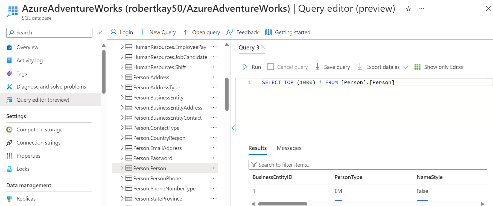

# Azure Database Migration

Within his project I establish a production environment database on a virtual machine with the AdventureWorks database. I then migrate this database to an Azure SQL Database. This ensures there is a backup which is easily accessible.

To increase data resiliance a developement enviroment is created on another virtual machine. The AdventureWorks database is imported from a blob storage container. Scheduled backups are also set up to increase resiliance further. 

A pivotal phase of the project involves simulating a disaster recovery scenario with potential data loss. This will demonstate how these backups can be utilised. Furthermore, it will explore the complexities of geo-replication and failover configuration to ensure data availability even under challenging conditions.

To enhance security, Microsoft Entra ID integration will then be employed to define access roles, adding an extra layer of control and protection.

## Milestone 1: Set up the environment

- I set up a repository on GitHub to track progress.

## Milestone 2: Set up the production Environment

- I set up a Windows Virtual Machine (VM) to serve as the cornerstone of the production environment. The specified VM uses the operating system Windows 11 Pro and is Standard B2ms (2 vcpus, 8 GiB memory).

## Milestone 3: Migrate to Azure SQL Database

- Created an Azure SQL Database, which served as the target for database migration.
- Installed and configured Azure Data Studio on the production Windows VM. I used this tool to establish a connection to the existing on-premise database.
- I leveraged this extension to compare and subsequently migrated the schema from the on-premise database to the Azure SQL Database.
- Installed the Azure SQL Migration extension within Azure Data Studio.
- This extension facilitated a smooth transfer of data from the on-premise database to the Azure SQL Database, ensuring a successful and seamless data migration process.
- I confirmed the success of the database migration process by comparing the schema of tables. I also chose a table at random and ensured the first 1000 rows had identical entries.

## Milestone 4: Set up the Development Environment and Introduce Regular Backups

- I began by generating a full backup of the production database hosted on the Windows VM.
  
- Once the backup was completed, it was stored in 'C:\Program Files\Microsoft SQL Server\MSSQL16.MSSQLSERVER\MSSQL\Backup/'.
- The file was then uploaded to a storage container within Microsoft Azure.
- I set up another virtual machine to act as the development environment. I installed SQL Server and SSMS just as I did on the production environment. I then downloaded the backup file and loaded it into SSMS.

- I then automated backups from the specified blob. To do this, I required creating a SQL Server Credential in SSMS. A SQL Server Credential is a security object that allows SQL Server to access external resources securely. To create a SQL Server Credential in SSMS, I right-clicked on the server name and selected New Query to open a new query window. Then, I executed the following T-SQL command to create the credentials:

- After doing this, backups from the blob could then be specified. This was done weekly on a Sunday night to minimize impact on the business.

## License information

Copyright (c) 2024 Robert Kay

Permission is hereby granted, free of charge, to any person obtaining a copy of this software and associated documentation files (the "Software"), to deal in the Software without restriction, including without limitation the rights to use, copy, modify, merge, publish, distribute, sublicense, and/or sell copies of the Software, and to permit persons to whom the Software is furnished to do so, subject to the following conditions:

The above copyright notice and this permission notice shall be included in all copies or substantial portions of the Software.

THE SOFTWARE IS PROVIDED "AS IS," WITHOUT WARRANTY OF ANY KIND, EXPRESS OR IMPLIED, INCLUDING BUT NOT LIMITED TO THE WARRANTIES OF MERCHANTABILITY, FITNESS FOR A PARTICULAR PURPOSE, AND NONINFRINGEMENT. IN NO EVENT SHALL THE AUTHORS OR COPYRIGHT HOLDERS BE LIABLE FOR ANY CLAIM, DAMAGES, OR OTHER LIABILITY, WHETHER IN AN ACTION OF CONTRACT, TORT, OR OTHERWISE, ARISING FROM, OUT OF, OR IN CONNECTION WITH THE SOFTWARE OR THE USE OR OTHER DEALINGS IN THE SOFTWARE.